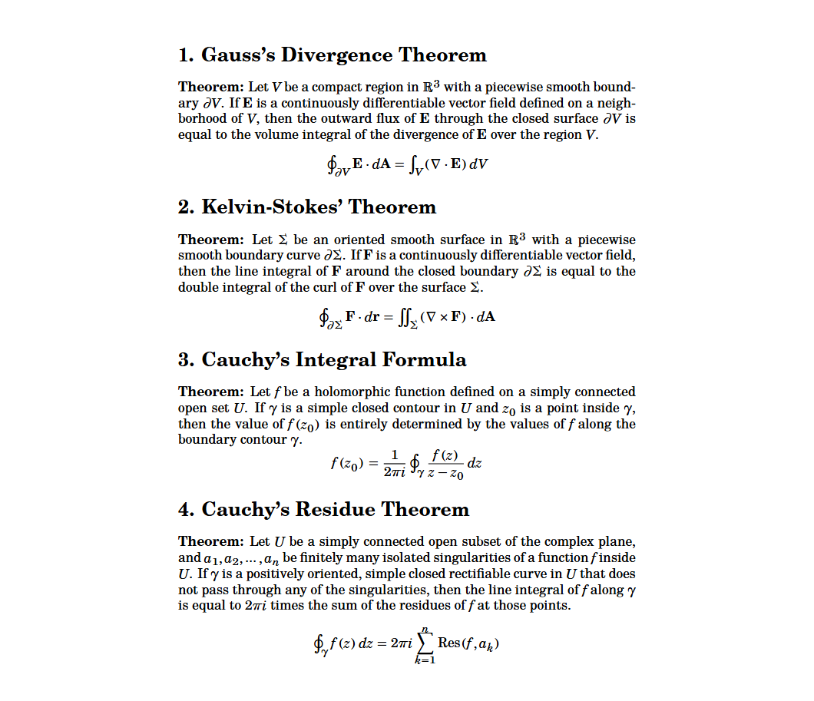
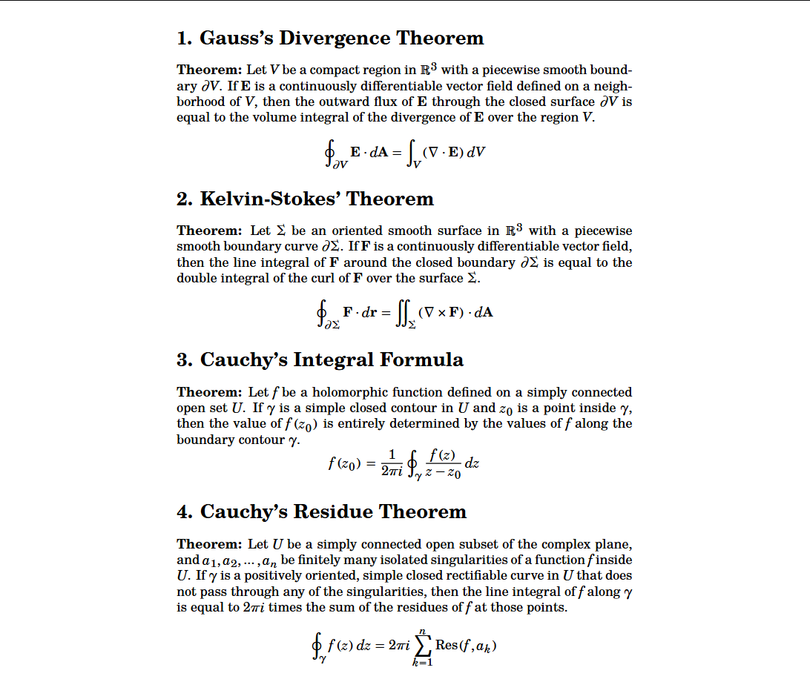

# TeX-Gyre-Schola-MFlashTweaks
A slightly tweaked version of the **TeX Gyre Schola Math** font, which was originally created and distributed by the **GUST e-foundry**. This is an unofficial derivative work.

## Modifications
This repository contains a modified version of the original font, intended for personal use and fixing quirks (like small integral height) with the original. I found that the original operator sizes felt a bit off or relatively disproportionate. But I love this font and wanted a neat solution to these minor irks.

### Changes Made (so far):
* Increased the minimum operator height
* Made the summation symbol more angular

## Files Included
* `texgyrescholamathflash.sfd`: The source file for FontForge.
* `texgyrescholamathflash.otf`: The compiled OpenType font, ready to install.

## Usage
Just like all OpenType fonts (OTF), you require the `LuaLatex` or `XeLatex` compiler. Use `\setmainfont{TeX Gyre Schola}` (if you have it installed, that is. This repo doesn't provide that. Highly recommended you use it: https://www.1001fonts.com/tex-gyre-schola-font.html) and `\setmathfont{TeXGyreScholaMath-FlashTweaks.otf}` in the preamble.

## Comparison
### Without tweaks (vanilla TeX Gyre Schola Math)

---

### With tweaks (this version)

Notice the difference in integral height and how much the summation sign protrudes out. I personally prefer those changes.
## Legal
Distributed under the **GUST Font License (GFL)**, which is practically identical to LPPL-1.3c. See the `LICENSE` file for the full license text. This font is a derivative work, renamed to prevent confusion with the official upstream release.
